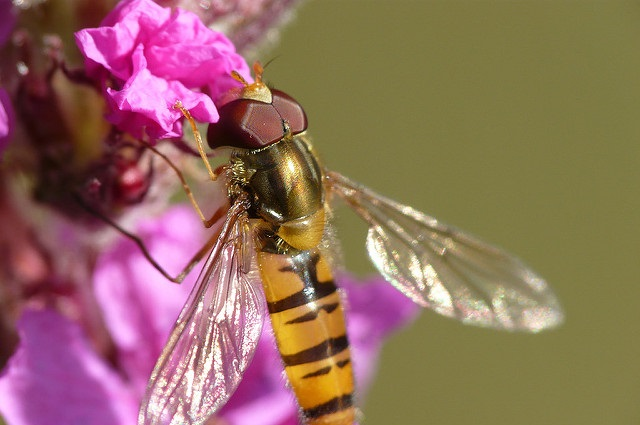

--- 
title: "Statistiques descriptives"
author: Solène Colin, Vivien Roussez & Pascal Irz
date: '`r format(Sys.time(), "%d %B %Y")`'
site: bookdown::bookdown_site
output: bookdown::gitbook
documentclass: book
biblio-style: apalike
link-citations: yes
description: "Statistiques descriptives avec R (module 3)"
---


# Introduction



<font size="2"> 
*Crédit photographique Pascal Boulin*
</font> 


## Le parcours de formation

```{r collecte prez parcours, results='asis', warning=FALSE, echo=FALSE}
# Utilisation du chapitre de présentation du parcours présent dans https://github.com/MTES-MCT/parcours-r
cat(stringi::stri_read_lines("https://raw.githubusercontent.com/MTES-MCT/parcours-r/master/parties_communes/le_parcours_R.Rmd", encoding = "UTF-8"), sep = "\n")

```

## Le groupe de référents R du pôle ministériel

```{r dependances_ref_R, include=FALSE}
library(sf)
library(COGiter)
```

```{r collecte prez ref, warning=FALSE, echo=FALSE, results='asis'}
# Utilisation du chapitre de présentation des référents présent dans https://github.com/MTES-MCT/parcours-r
a <- knitr::knit_child(text = stringi::stri_read_lines("https://raw.githubusercontent.com/MTES-MCT/parcours-r/master/parties_communes/les_referents_R.Rmd", encoding = "UTF-8"), quiet = TRUE)
cat(a, sep = '\n')
```


## Objectif du module 3

Ce qui est visé est une autonomie en matière de statistiques de base avec le logiciel R.

Le module comprend, pour chacune des parties ci-dessous, l’acquisition ou le rappel des notions statistiques abordées, ainsi que la maîtrise de la production et de l'interprétation, avec le logiciel R, des statistiques descriptives, des représentations graphiques et des tests usuels.

## Notions et méthodes présentées

### Analyse univariée d’une variable quantitative

- Histogramme
- Courbe de densité
- Diagramme quantile-quantile
- Statistiques de tendance centrale (moyenne, médiane)
- Statistiques de dispersion (variance, coefficient de variation, intervalle inter-quartiles)
- Méthodes de discrétisation

### Analyse univariée d’une variable qualitative
- Diagrammes en barres et en secteurs
- Tableau de fréquences pondérées ou non pondérées


### Relation entre 2 variables quantitatives
- Nuage de points
- Corrélation paramétrique ou non paramétrique

### Relation entre 2 variables qualitatives
- Graphique en barres empilées ou juxtaposées
- Graphique en mosaïque
- Tableau de contingence
- Profils-lignes et profils-colonnes
- Test du $\chi^2$, V de Cramer

### Relation entre une variable qualitative et une variable quantitative
- Agrégation d’une variable quantitative selon une variable qualitative
- Boxplot, violin plot
- ANOVA


## Fondamentaux R présentés
Objets R, scripts, graphiques avec `ggplot2`, tests avec les packages de `base`, `dplyr` et `lsr`.
